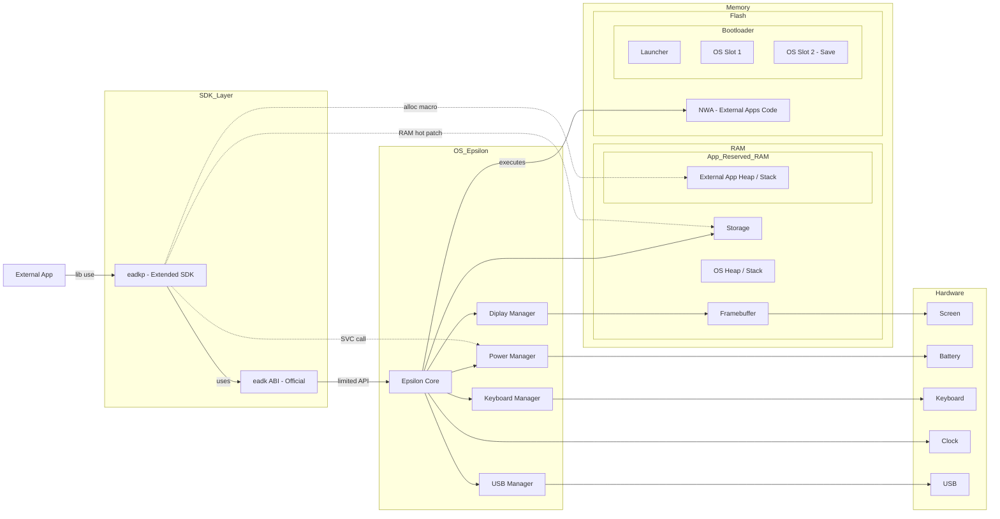

<h1 align="center">
   
  
  
</h1>

    
    
    
     
    
    
    
     
    
    
    
    

 

  <a href="./README_EN.md">English</a> | <strong>Français</strong>

**Eadkp** est un **framework** Rust destinée au développement d’applications pour
les calculatrices **NumWorks** sous **Epsilon**.

Elle fournit des fonctionnalités de bas niveau permettant d’interagir avec le
matériel de la calculatrice, notamment la gestion de l’affichage, des entrées
utilisateur, de la batterie et du stockage.

Le framework propose également des abstractions de plus haut niveau afin de
simplifier le développement d’applications en Rust, telles que la gestion du
*panic handler*, de l’allocateur global, ainsi que la déclaration des propriétés
des applications **NWA**.

Ce repot est la librairie `eadkp`, le core du projet, qui peut être utilisé indépendamment de la template de projet officielle,
mais il est recommandé d'utiliser la template pour une meilleure expérience de développement. 

[Vidéo de démonstration d'une application de test propulsée par eadkp](https://www.youtube.com/watch?v=KNKvgqE-Wmg)

## Fonctionnalités

- [x] Handlers Rust pour l'ABI Epsilon
- [x] Gestion basique de l'affichage
- [x] Gestion des entrées utilisateur (clavier)
- [x] Gestion de la batterie
- [x] Gestion du stockage (lecture/écriture de fichiers)
- [x] Macros pour déclarer les propriétés des applications NWA
- [x] Gestion simple des images (inclusion et affichage) via macro
- [ ] Support des fichiers C et C++ (Non documenté) (Problème majeur)
- [x] Support du simulateur officiel Numworks
- [ ] Support des fichiers données a l'inclusion dans les applications NWA
- [ ] Support des graphiques avancés
- [ ] Débogage via USB (Pas encore évaluée la faisabilité)

## Créer votre propre application propulsée par eadkp

Eadkp a besouin d'un environnement spécifique pour fonctionner correctement.

Consultez le [Quick Start sur le wiki](https://github.com/Oignontom8283/eadkp/wiki/FR-Home#d%C3%A9marrage-rapide) pour créer votr propre application propulsée par eadkp.

## Fonctionnement

Eadkp a deux champs de fonctionnement principaux, **Officiel** et **Bypass** :
- **Officiel: SDK étendu/abstract** : Fournit des handlers Rust pour l'ABI d'Epsilon, ainsi que des abstractions pour interagir avec cette API de manière plus ergonomique.
- **Bypass: Appel de registres** : Fournit des fonctions pour faire des appels directs aux CPU, comme des appels SVC pour interagir avec le Power Manager.
- **Bypass: Hot patching de la RAM** : Fournit des fonctions qui par hot patch de la RAM, permettent par exemple de manipuler le file system (Storage) de la calculatrice.

### Schema de positionnement et interaction d'eadkp :

## Contribution

Les contributions sont les bienvenues ! N'hésitez pas à ouvrir des issues ou à soumettre des pull requests.

Pour apprendre comment contribuer, consultez les guides suivants :
- [Guide de setup du projet](docs/SETUPS/Setup.md)
- [Guide de compilation de l'exemple de test](docs/SETUPS/BuildExample.md)
- [Guide d'utilisation du simulateur](docs/SETUPS/Simulator.md)

## Pourquoi en Francais ?

Eadkp est un projet destiné à la communauté Numworks. Or, la calculatrice 
Numworks étant quasi exclusivement démocratisée en France, la majorité de 
la communauté est francophone. 

Il est donc plus logique de documenter le projet en français afin de le 
rendre plus accessible à la cible visée. Nous visons particulièrement 
une bonne intégration des nouveaux venus, qui seront probablement de 
jeunes étudiants francophones.

## Licence & Crédits

Ce projet est distribué sous [licence LGPL-3.0](./LICENSE) (GNU Lesser General Public License v3.0).

Bien que ce projet ait bénéficié d'une refonte architecturale majeure, il reconnaît l'héritage des travaux suivants :

- **Sous-module de Stockage (file system):**
La logique bas niveau du sous module `storage` a été initialement inspirée par
[NumWorks Extapp Storage](https://framagit.org/Yaya.Cout/numworks-extapp-storage/-/tree/62e3d4c44437b93a8f14ce687a1c45d6dded87d9). (Licence MIT)
- **Handlers Rust pour l'ABI Epsilon:**
Les premières implémentations des handlers Rust pour l'ABI d'Epsilon EADK proviennent de
[NumCraft Rust v0.1.4](https://github.com/yannis300307/NumcraftRust/tree/b61d72214f116ce81a9a296426a27ba4a7ee1f6c). (Licence GPL-3.0)

Conformément à la LGPL-3.0, les travaux originaux sont reconnus et crédités.
Les modifications substantielles et les nouvelles fonctionnalités introduites dans ce projet sont couvertes par la licence LGPL-3.0 actuelle,
afin de permettre une meilleure interopérabilité de la bibliothèque avec d'autres projets.

## Remerciements

Un grand merci aux développeurs suivants pour leurs travails dans la communauté NumWorks  :
- [Yannis300307](https://github.com/yannis300307)
- [Yaya Cout](https://framagit.org/Yaya.Cout) (*Special thanks*)

## Informations légales

Eadkp n'est en aucun cas affilié à NumWorks, Epsilon (OS) ou leurs partenaires. Eadkp est un projet open-source communautaire et indépendant.