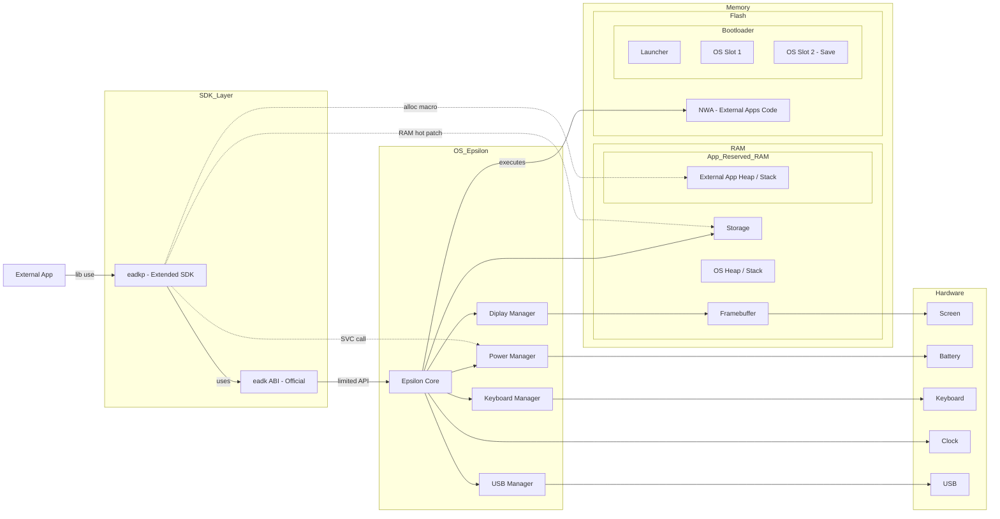

<h1 align="center">
  <br>
  <kbd>v0.11.2-alpha.2</kbd>
  
</h1>

<p align="center">
    <a href="https://github.com/Oignontom8283/eadkp/graphs/commit-activity">
        
    </a>
    
    <a href="https://github.com/Oignontom8283/eadkp/blob/main/LICENSE">
        
    </a>
    <br/>
    <a href="https://github.com/Oignontom8283/eadkp/actions">
        
    </a>
    
    
    <br/>
    <a href="https://github.com/Oignontom8283/eadkp/stargazers">
        
    </a>
    <a href="https://github.com/Oignontom8283/eadkp/network/members">
        
    </a>
    <a href="https://github.com/Oignontom8283/eadkp/issues">
        
    </a>
    <a href="https://github.com/Oignontom8283/eadkp/pulls">
        
    </a>
</p>

**Eadkp** est une bibliothèque Rust destinée au développement d’applications pour
les calculatrices **NumWorks** sous **Epsilon**.

Elle fournit des fonctionnalités de bas niveau permettant d’interagir avec le
matériel de la calculatrice, notamment la gestion de l’affichage, des entrées
utilisateur, de la batterie et du stockage.

La bibliothèque propose également des abstractions de plus haut niveau afin de
simplifier le développement d’applications en Rust, telles que la gestion du
*panic handler*, de l’allocateur global, ainsi que la déclaration des propriétés
des applications **NWA**.

## Fonctionnalités

- [x] Handlers Rust pour l'ABI Epsilon
- [x] Gestion basique de l'affichage
- [x] Gestion des entrées utilisateur (clavier)
- [x] Gestion de la batterie
- [x] Gestion du stockage (lecture/écriture de fichiers)
- [x] Macros pour déclarer les propriétés des applications NWA
- [x] Gestion simple des images (inclusion et affichage) via macro
- [ ] Support des fichiers C et C++ (Non documenté) (Problème majeur)
- [x] Support du simulateur officiel Numworks
- [ ] Support des fichiers données a l'inclusion dans les applications NWA
- [ ] Support des graphiques avancés
- [ ] Débogage via USB (Pas encore évaluée la faisabilité)

## Installation et utilisation

La méthode recommandée pour utiliser Eadkp est d'utiliser la [template de projet](https://github.com/Oignontom8283/eadkp_template) officielle.
Nous détailleons donc son utilisation et installation ici.

### 1. Prérequis
- Docker (Si Windows, docker sur Windows, pas sur WSL)
- Git
- Bash (wsl sur windows)

### 2. Download de la template
Vous avez le choix entre cloner le dépôt git, créer votre repôt à partir de la template sur GitHub, ou utiliser le script automatique.

#### Cloner le dépôt git
```bash
git clone https://github.com/Oignontom8283/eadkp_template my_eadkp_project
cd my_eadkp_project
chmod +x bootstrap.sh
./bootstrap.sh
```

#### Créer un dépôt à partir de la template sur GitHub
1. Allez sur la page de la template : https://github.com/Oignontom8283/eadkp_template
2. Cliquez sur "Use this template" et suivez les instructions pour créer votre propre dépôt.
3. Clonez votre nouveau dépôt localement et exécutez le script de bootstrap :
```bash
git clone https://github.com/VotreNom/votre_depot
cd votre_depot
chmod +x bootstrap.sh
./bootstrap.sh
```

#### Utiliser le script automatique

Utiliser la commande suivante pour initialiser un projet eadkp. Suivez les instructions si demandé :

```bash
bash <(curl -s https://raw.githubusercontent.com/Oignontom8283/eadkp_template/main/bootstrap.sh)
cd my_app
```
OU
```bash
bash <(curl -s https://raw.githubusercontent.com/Oignontom8283/eadkp_template/main/bootstrap.sh) --name "my_app"
cd my_app
```

### 3. Lancer docker

```bash
chmod +x start.sh
./start.sh
```

Attendez que le conteneur soit prêt. Cela peut prendre plusieur minutes lors du premier lancement.

### 4. Entrer dans l'environnement

#### Terminal
Pour entrer dans le shell du conteneur :
```bash
./shell.sh
```
> [!IMPORTANT]
> Pour lancer le simulateur il faut passer par un vrai terminal (pas l'IDE) et utiliser `./shell.sh`, sinon le lien avec le serveur X ne fonctionnera pas.

#### IDE

Pour Visul Studio Code, utilisez l'extension [Remote Developement](https://marketplace.visualstudio.com/items?itemName=ms-vscode-remote.vscode-remote-extensionpack)
pour vous connecter au conteneur et utiliser l'environnement comme si vous n'étiez pas dans un conteneur.

> [!NOTE]
> Permet la compatibilité avec Rust Analyzer et d'autres extensions de développement.
> Sur Windows, utiliser l'IDE sur Windows, il pourra se connecter au conteneur, même si lancer dans WSL.

### 5. Compiler et Simulator

#### Compilation / Exportation
Pour compiler le projet utilisez :
```bash
just build
```
Mais pour compiler l'application empaquetée en NWA, utilisez :
```bashbash
just export
```
Le fichier .nwa génére se trouvera dans `./build/`.

#### Simulateur

Pour lancer le simulateur officiel NumWorks avec votre application, utilisez :
```bash
just sim
```
> [!IMPORTANT]
> Vous devez être dans un vrai terminal (pas l'IDE) et utiliser `./shell.sh` pour que le lien avec le serveur X fonctionne (WSL2 embarque un serveur X et les distributions Linux aussi pour la plupart), sinon le simulateur ne pourra pas se lancer.

La commande va télécharger et lancer le simulateur officiel de Numworks depuis son dépôt.
A la **première utilisation**, le simulateur va devoir ce compiler, ce qui peut prendre plusieurs minutes ou dixaines de minutes.

Une fenêtre représentant la calculatrice va s'ouvrir, et votre application sera automatiquement lancée dessus.

> [!NOTE]
> Si vous utiliser des fonctionnalités avancées d'eadkp ou hardware, vous devrez créer une alternative en `#[cfg(target_os = "none")]` et une autre
> en `#[cfg(not(target_os = "none"))]` qui **dummy** la fonctionnalité, car sur Simulateur, les composants n'existent pas.

## Fonctionnement

Eadkp a deux champs de fonctionnement principaux, **Officiel** et **Bypass** :
- **Officiel: SDK étendu/abstract** : Fournit des handlers Rust pour l'ABI d'Epsilon, ainsi que des abstractions pour interagir avec cette API de manière plus ergonomique.
- **Bypass: Appel de registres** : Fournit des fonctions pour faire des appels directs aux CPU, comme des appels SVC pour interagir avec le Power Manager.
- **Bypass: Hot patching de la RAM** : Fournit des fonctions qui par hot patch de la RAM, permettent par exemple de manipuler le file system (Storage) de la calculatrice.

### Schema de positionnement et interaction d'eadkp :


## Contribution

Les contributions sont les bienvenues ! N'hésitez pas à ouvrir des issues ou à soumettre des pull requests.

Pour apprendre à utiliser le projet, consultez les guides suivants :
- [Guide de setup du projet](docs/SETUPS/Setup.md)
- [Guide de compilation de l'exemple de test](docs/SETUPS/BuildExample.md)
- [Guide d'utilisation du simulateur](docs/SETUPS/Simulator.md)

## Licence
Ce projet est sous licence [GPL-3.0](./LICENSE) (GNU General Public License v3.0).

Technologie de `storage.rs` basée sur [NumWorks Extapp Storage](https://framagit.org/Yaya.Cout/numworks-extapp-storage) sous [licence MIT](https://framagit.org/Yaya.Cout/numworks-extapp-storage/-/blob/master/LICENSE-MIT) (commit: 62e3d4c44437b93a8f14ce687a1c45d6dded87d9).

Projet basé sur l'eadk et utilitaire de [NumCraft version v0.1.4](https://github.com/yannis300307/NumcraftRust/tree/v0.1.4) sous [licence GPL-3.0](https://github.com/yannis300307/NumcraftRust/blob/v0.1.4/LICENSE).

## Remerciements

Merci à [Yannis300307](https://github.com/yannis300307) pour son travail sur NumCraft Rust, qui a servi de base à ce projet.

Également merci à [Yaya Cout](https://framagit.org/Yaya.Cout) pour son travail sur la manipulation du file system interne de la NumWorks par des applications externes.