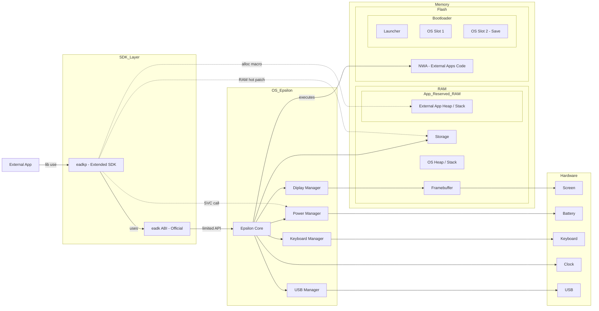

<h1 align="center">
  <br>
  
  
</h1>

<p align="center">
	<a href="https://github.com/Oignontom8283/eadkp/graphs/commit-activity">
		
	</a>
	
	<a href="https://github.com/Oignontom8283/eadkp/blob/main/LICENSE">
		
	</a>
	<br/>
	<a href="https://github.com/Oignontom8283/eadkp/actions">
		
	</a>
	
	
	<br/>
	<a href="https://github.com/Oignontom8283/eadkp/stargazers">
		
	</a>
	<a href="https://github.com/Oignontom8283/eadkp/network/members">
		
	</a>
	<a href="https://github.com/Oignontom8283/eadkp/issues">
		
	</a>
	<a href="https://github.com/Oignontom8283/eadkp/pulls">
		
	</a>
</p>

<p align="center">
  <a href="./README.md">French</a> | <strong>English</strong>
</p>

**Eadkp** is a Rust library designed for developing applications for **NumWorks** calculators running **Epsilon**.

It provides low-level features to interact with calculator hardware, including display management, user input handling, battery access, and storage operations.

The library also offers higher-level abstractions to simplify Rust application development, such as panic handler support, global allocator setup, and **NWA** application property declarations.

## Features

- [x] Rust handlers for the Epsilon ABI
- [x] Basic display management
- [x] User input handling (keyboard)
- [x] Battery management
- [x] Storage management (file read/write)
- [x] Macros to declare NWA application properties
- [x] Simple image handling (inclusion and rendering) via macro
- [ ] C and C++ file support (Undocumented) (Major issue)
- [x] Official NumWorks simulator support
- [ ] Support for embedding data files in NWA applications
- [ ] Advanced graphics support
- [ ] USB debugging (feasibility not yet evaluated)

## Installation and Usage

The recommended way to use Eadkp is through the official [project template](https://github.com/Oignontom8283/eadkp_template).
Its setup and usage are detailed below.

### 1. Prerequisites
- Docker (On Windows, install Docker on Windows, not in WSL)
- Git
- Bash (WSL on Windows)

### 2. Download the Template
You can clone the Git repository, create your own repository from the GitHub template, or use the automatic script.

#### Clone the Git Repository
```bash
git clone https://github.com/Oignontom8283/eadkp_template my_eadkp_project
cd my_eadkp_project
chmod +x bootstrap.sh
./bootstrap.sh
```

#### Create a Repository from the GitHub Template
1. Go to the template page: https://github.com/Oignontom8283/eadkp_template
2. Click "Use this template" and follow the instructions to create your own repository.
3. Clone your new repository locally and run the bootstrap script:
```bash
git clone https://github.com/YourName/your_repository
cd your_repository
chmod +x bootstrap.sh
./bootstrap.sh
```

#### Use the Automatic Script

Use the following command to initialize an Eadkp project. Follow any prompts if needed:

```bash
bash <(curl -s https://raw.githubusercontent.com/Oignontom8283/eadkp_template/main/bootstrap.sh)
cd my_app
```
OR
```bash
bash <(curl -s https://raw.githubusercontent.com/Oignontom8283/eadkp_template/main/bootstrap.sh) --name "my_app"
cd my_app
```

### 3. Start Docker

```bash
chmod +x start.sh
./start.sh
```

Wait until the container is ready. On first launch, this can take several minutes.

### 4. Enter the Environment

#### Terminal
To enter the container shell:
```bash
./shell.sh
```
> [!IMPORTANT]
> To launch the simulator, use a real terminal (not the IDE terminal) and run `./shell.sh`; otherwise, the X server link will not work.

#### IDE

For Visual Studio Code, use the [Remote Development](https://marketplace.visualstudio.com/items?itemName=ms-vscode-remote.vscode-remote-extensionpack) extension pack
to connect to the container and work as if you were outside a container.

> [!NOTE]
> This ensures compatibility with Rust Analyzer and other development extensions.
> On Windows, run the IDE on Windows; it can still connect to the container even if started from WSL.

### 5. Build and Simulate

#### Build / Export
To build the project, run:
```bash
just build
```
To build and package the application as NWA, run:
```bash
just export
```
The generated `.nwa` file will be available in `./build/`.

#### Simulator

To launch the official NumWorks simulator with your application, run:
```bash
just sim
```
> [!IMPORTANT]
> You must use a real terminal (not the IDE terminal) and run `./shell.sh` so that the X server link works (WSL2 includes an X server and most Linux distributions do too); otherwise, the simulator cannot start.

This command downloads and runs the official NumWorks simulator from its repository.
On **first use**, the simulator needs to compile, which can take several minutes or even tens of minutes.

A calculator window will open, and your application will be launched automatically.

> [!NOTE]
> If you use advanced Eadkp or hardware features, split your code into one version with `#[cfg(target_os = "none")]` and another with `#[cfg(not(target_os = "none"))]` that provides dummy behavior, because simulator RAM components/objects are not the same as on hardware.

## How It Works

Eadkp has two main operation areas: **Official** and **Bypass**:
- **Official: Extended/abstract SDK**: Provides Rust handlers for the Epsilon ABI and abstractions to interact with this API more ergonomically.
- **Bypass: Register calls**: Provides functions for direct CPU-level calls, such as SVC calls to interact with the Power Manager.
- **Bypass: RAM hot patching**: Provides functions that hot patch RAM to, for example, manipulate the calculator file system (Storage).

### Eadkp Positioning and Interaction Diagram


## Contribution

Contributions are welcome. Feel free to open issues or submit pull requests.

To learn how to use the project, check these guides:
- [Project setup guide](docs/SETUPS/Setup.md)
- [Test example build guide](docs/SETUPS/BuildExample.md)
- [Simulator usage guide](docs/SETUPS/Simulator.md)

## License & Credits

This project is distributed under the [LGPL-3.0 license](./LICENSE) (GNU Lesser General Public License v3.0).

Although this project has undergone a major architectural refactor, it acknowledges the heritage of the following works:

- **Storage submodule (file system):**
The low-level logic of the `storage` submodule was originally inspired by
[NumWorks Extapp Storage](https://framagit.org/Yaya.Cout/numworks-extapp-storage/-/tree/62e3d4c44437b93a8f14ce687a1c45d6dded87d9). (MIT License)
- **Rust handlers for the Epsilon ABI:**
Early implementations of Rust handlers for the Epsilon EADK ABI come from
[NumCraft Rust v0.1.4](https://github.com/yannis300307/NumcraftRust/tree/b61d72214f116ce81a9a296426a27ba4a7ee1f6c). (GPL-3.0 License)

In accordance with LGPL-3.0, original works are recognized and credited.
Substantial modifications and new features introduced in this project are covered by the current LGPL-3.0 license,
to allow better interoperability of the library with other projects.

## Acknowledgments

Many thanks to the following developers for their work in the NumWorks community:
- [Yannis300307](https://github.com/yannis300307)
- [Yaya Cout](https://framagit.org/Yaya.Cout) (*Special thanks*)

## Legal Information

Eadkp is in no way affiliated with NumWorks, Epsilon (OS), or their partners. Eadkp is an independent, community-driven open-source project.
