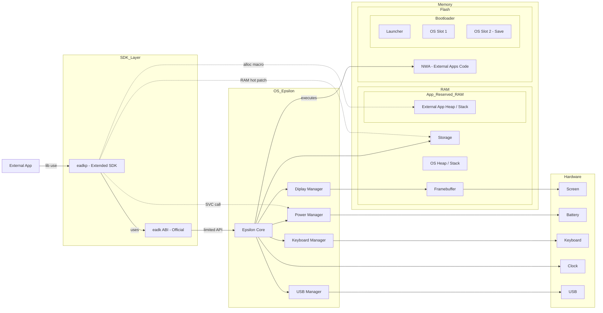

<h1 align="center">
   
  
  
</h1>

	
	
	
	 
	
	
	
	 
	
	
	
	

 

  <strong>English</strong> | <a href="./README.md">Français</a>

**Eadkp** is a Rust **framework** designed for developing applications for [**NumWorks**](https://fr.wikipedia.org/wiki/NumWorks)
calculators running **Epsilon** (Upsilon/Omega are not supported).

Eadkp is comparable to React, but for calculators. Eadkp-based projects use the `eadkp` library and the tools it provides,
just as React projects use the React library and its tooling.

It provides low-level features to interact with calculator hardware, including display management,
user input handling, battery access, and storage operations.

The framework also offers higher-level abstractions to simplify Rust application development,
such as panic handler support, global allocator setup, and **NWA** application property declarations.

**⚠️ This repository is the `eadkp` library, the core of the project, which can be used independently of the official project template,
but it is recommended to use the template for a better development experience.**

[Demo video of an eadkp-powered test application](https://www.youtube.com/watch?v=KNKvgqE-Wmg)

## Features

- [x] Rust handlers for the Epsilon ABI
- [x] Basic display management
- [x] User input handling (keyboard)
- [x] Battery management
- [x] Storage management (file read/write)
- [x] Macros to declare NWA application properties
- [x] Simple image handling (inclusion and rendering) via macro
- [ ] C and C++ file support (Undocumented) (Major issue)
- [x] Official NumWorks simulator support
- [ ] Support for embedding data files in NWA applications
- [ ] Advanced graphics support
- [ ] USB debugging (feasibility not yet evaluated)

## Create your own eadkp-powered project

Eadkp requires a specific environment to function properly.

Check out the [Quick Start on the wiki](https://github.com/Oignontom8283/eadkp/wiki#getting-started) to create your own eadkp-powered application.

## How It Works

Eadkp has two main operation areas: **Official** and **Bypass**:
- **Official: Extended/abstract SDK**: Provides Rust handlers for the Epsilon ABI and abstractions to interact with this API more ergonomically.
- **Bypass: Register calls**: Provides functions for direct CPU-level calls, such as SVC calls to interact with the Power Manager.
- **Bypass: RAM hot patching**: Provides functions that hot patch RAM to, for example, manipulate the calculator file system (Storage).

### Eadkp Positioning and Interaction Diagram

## Contribution

Contributions are welcome. Feel free to open issues or submit pull requests.

To learn how to use the project, check these guides:
- [Project setup guide](docs/SETUPS/Setup.md)
- [Test example build guide](docs/SETUPS/BuildExample.md)
- [Simulator usage guide](docs/SETUPS/Simulator.md)

## Why in French?

Eadkp is a project dedicated to the Numworks community. Since Numworks 
calculators are almost exclusively popular in France, the vast majority 
of the community is French-speaking.

It is therefore more logical to document the project in French to make 
it more accessible to our target audience, especially as we aim to 
onboard newcomers who are likely to be young French-speaking students.

> *You are reading the English version of the README, but the internal code documentation and guides are written in French.
If you are not a French speaker and wish to actively contribute to the project,
please let us know. We will handle translating the specific areas of code you are targeting into English.*

## License & Credits

This project is distributed under the [LGPL-3.0 license](./LICENSE) (GNU Lesser General Public License v3.0).

Although this project has undergone a major architectural refactor, it acknowledges the heritage of the following works:

- **Storage submodule (file system):**
The low-level logic of the `storage` submodule was originally inspired by
[NumWorks Extapp Storage](https://framagit.org/Yaya.Cout/numworks-extapp-storage/-/tree/62e3d4c44437b93a8f14ce687a1c45d6dded87d9). (MIT License)
- **Rust handlers for the Epsilon ABI:**
Early implementations of Rust handlers for the Epsilon EADK ABI come from
[NumCraft Rust v0.1.4](https://github.com/yannis300307/NumcraftRust/tree/b61d72214f116ce81a9a296426a27ba4a7ee1f6c). (GPL-3.0 License)

In accordance with LGPL-3.0, original works are recognized and credited.
Substantial modifications and new features introduced in this project are covered by the current LGPL-3.0 license,
to allow better interoperability of the library with other projects.

## Acknowledgments

Many thanks to the following developers for their work in the NumWorks community:
- [Yannis300307](https://github.com/yannis300307)
- [Yaya Cout](https://framagit.org/Yaya.Cout) (*Special thanks*)

## Legal Information

Eadkp is in no way affiliated with NumWorks, Epsilon (OS), or their partners. Eadkp is an independent, community-driven open-source project.
