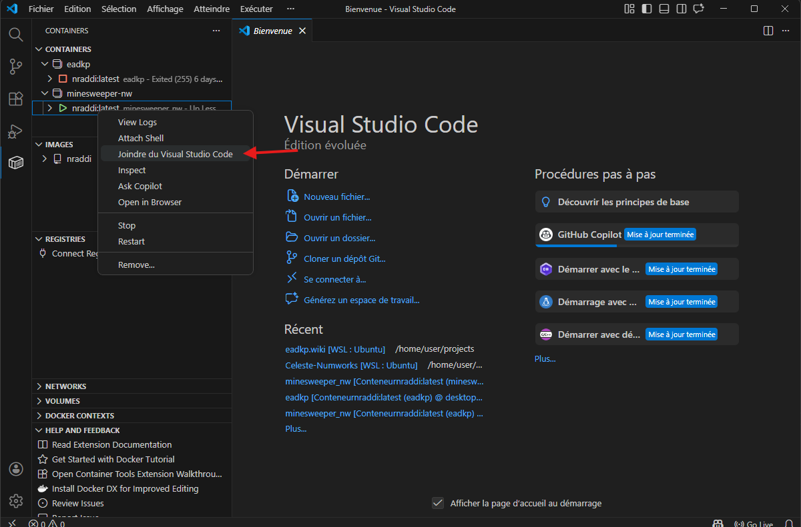

# Getting Started 

Create a new project powered by Eadkp.

## Prerequisites
- Docker (On Windows, install Docker Desktop on Windows and not in WSL)
- Git (On Windows, install Git in WSL)

## Creation

To simplify project creation, we will use an automation script that builds a base project for us.

```bash
bash <(curl -s https://raw.githubusercontent.com/Oignontom8283/eadkp_template/main/bootstrap.sh) --name "my_app"
```
```bash
cd my_app
```

> [!IMPORTANT]
> On Windows, use WSL and run the commands in WSL.

## Launch

The base project uses Docker to simplify installation of the environment required to run the application.

```bash
chmod +x ./docker.sh
```
```bash
./docker.sh start
```

> [!NOTE]
> Docker includes many dependencies, so the first build can take a long time. Please be patient.

## Accessing the application

Once the Docker container is running, to start developing you need to enter the container.

### VSCode

On your OS (not in WSL if you are on Windows), open VSCode.

Download the [Remote Development](https://marketplace.visualstudio.com/items?itemName=ms-vscode-remote.vscode-remote-extensionpack) extension pack.

In the new tab on the left, right-click your Docker container and click "Join in Visual Studio Code".



You can now work inside your Docker container as if you were working on your local machine.

### Terminal

In your terminal, use the script to access the Docker container.

```bash
./docker.sh shell
```