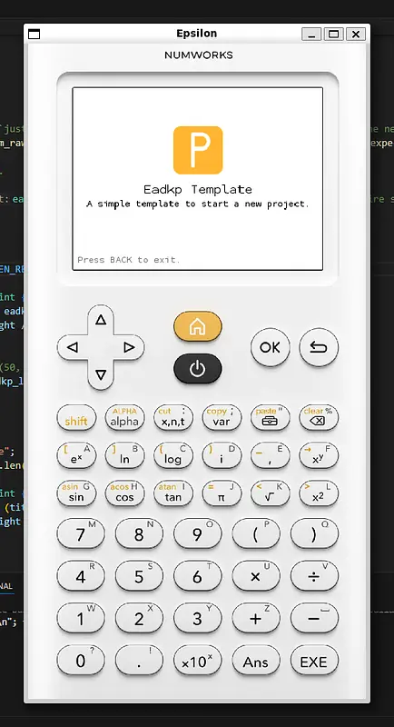

# Simulator

The template includes a simulator that lets you test your application on your computer without flashing it to the calculator.


## Why Use the Simulator

This is especially valuable because the calculator's flash memory degrades with each write cycle, the less you write to it, the better.

> [!IMPORTANT]
> This is a **simulator**, not an **emulator**, it does not replicate the calculator's hardware.
> If your code directly accesses hardware, the simulator cannot handle it, and you will need to test on a physical device. In that case,
> consider providing a dummy/stub implementation of those features for use in the simulator.


## Running the Simulator

Open a terminal (**not** an IDE-embedded terminal, a standalone one), navigate to your project folder (inside WSL if you're on Windows), and run:

```bash
./docker.sh sim {threads}
```

Replace `{threads}` with the number of threads to allocate for compilation, more threads means faster builds.

> [!NOTE]
> This is the official Numworks simulator, downloaded from their GitHub repository and compiled locally.
> We cannot distribute a pre-compiled binary for licensing reasons.
>
> **The first build may take a while, this is expected.**

Once running, a window representing a Numworks calculator will appear. You can interact with it just like a physical device.



*This illustration is deprecated; the template’s default UI no longer looks like this.*

## Troubleshooting

- **Black screen or freeze on startup:** Your code likely has no way to exit its main loop.
If nothing (e.g. a keypress) can break out of the loop, the simulator will not run it.

- **Instant crash:** Most likely caused by an instruction the simulator doesn't support, typically a hardware access attempt or use of an unsimulated feature.

- **Window closes immediately:** Your code probably has no main loop at all, so the program runs to completion and exits right away.