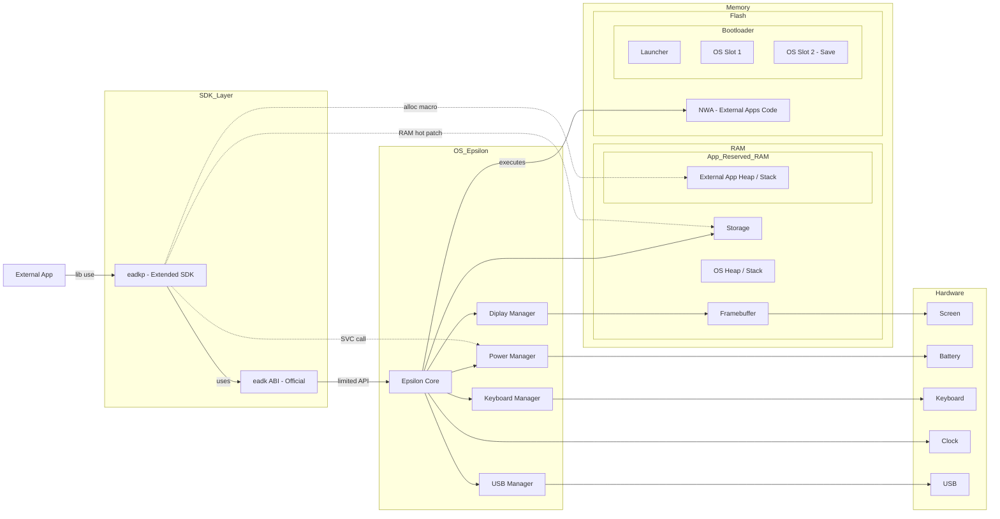

# Markdown Extension Examples

This page demonstrates some of the built-in markdown extensions provided by VitePress.

## Syntax Highlighting

VitePress provides Syntax Highlighting powered by [Shiki](https://github.com/shikijs/shiki), with additional features like line-highlighting:

**Output**

```js{4}
export default {
  data () {
    return {
      msg: 'Highlighted!'
    }
  }
}
```

```rs
/// Trouve la prochaine position libre dans le stockage
/// 
/// Retourne un pointeur vers le début de la fin de l'espace utilisé (le prochain enregistrement vide).
/// Si le stockage est plein, retourne l'adresse de fin du stockage utilisable
/// 
/// @unchecked
#[cfg(target_os = "none")]
#[doc(hidden)]
pub fn next_free() -> *const u8 {

    let storage = epsilon::storage();
    let usable_end_addr = storage.usable_end_addr;
    let mut offset = storage.usable_start_addr;

    while offset < usable_end_addr {
        let size = unsafe { ptr::read_unaligned(offset as *const u16) };
        if size == 0 {
            return offset;
        }
        offset = unsafe { offset.add(size as usize) };
    }

    usable_end_addr
}
```

## Custom Containers

**Output**

::: info
This is an info box.
:::

::: tip
This is a tip.
:::

::: success
This is a success message.
:::

::: warning
This is a warning.
:::

::: danger
This is a dangerous warning.
:::

::: details
This is a details block.
:::

## More



Check out the documentation for the [full list of markdown extensions](https://vitepress.dev/guide/markdown).
